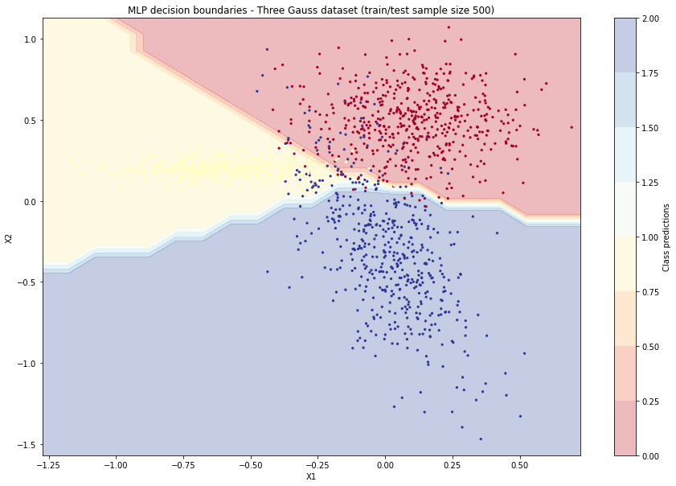

# Toygrad

A minimal MLP neural net library implemented in ~350 lines of code using only Numpy,
putting emphasise on code readability and extendibility.

This was written as kind of "do once and forget" project but could be easily reused:

* For education purposes. Going through a single file which uses common Numpy operations is
more convenient than digging into large multilayer codebases.

* To experiment with custom loss/activation functions. Inherit from `Loss`/`Activation`
class, add two methods and you're ready to test your ideas.

* When using lightweight, single file (but somewhat limited) solution would be preferred over usual neural network libraries.

The following example shows sample architecture for MNIST dataset, scoring accuracy of 92% over 100 epochs.

```python3
from toygrad import MLP, Layer, SoftMax, TanH, CategoricalCrossEntropy, Accuracy

layers = [
    Layer(in_size=28*28, out_size=256, activ_function=TanH),
    Layer(in_size=256, out_size=10, activ_function=SoftMax),
]

m = MLP(
    layers=layers,
    loss=CategoricalCrossEntropy,
    metrics=[Accuracy],
    bias=True,
    batch_size=8,
    epochs=100,
    momentum=0.1,
    learning_rate=0.4,
    verbosity=1,
)
stats = m.train(X_train, Y_train, X_test, Y_test)
```

The output (depending on verbosity) may be something along:
```txt
Epoch   10
 Accuracy_train: 0.837
 Accuracy_test: 0.848
 CategoricalCrossEntropy_train: 1.224
 CategoricalCrossEntropy_train_std: 2.423
 CategoricalCrossEntropy_test: 1.130
 CategoricalCrossEntropy_test_std: 3.308

...
```
In `experiment.ipynb` notebook you can find both classification and regression examples, here's a taste:



### Supported activations and losses

#### Activations

* Sigmoid
* SoftMax
* Linear
* ReLU
* TanH

#### Lossses

* SquaredError
* AbsoluteError
* BinaryCrossEntropy
* CategoricalCrossEntropy

### How to run it?

This library will work with any Numpy and Python 3.6.
If you'd like to run & reproduce test notebook results 
you could use `requirements.txt` file.
For example using Python built-in venv:

```bash
python3 -m venv venv
source venv/bin/activate
pip install -r requirements.txt
```

After that you can run `experiment.ipynb` notebook with:

```bash
python -m jupyterlab
```
