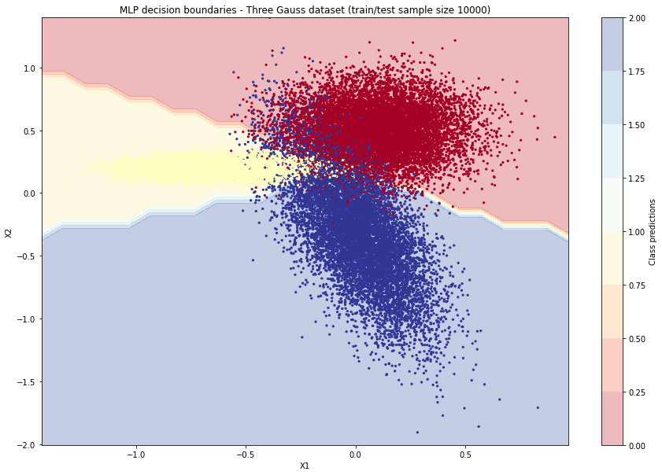
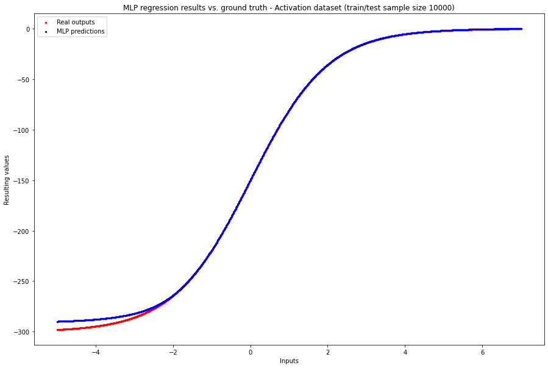
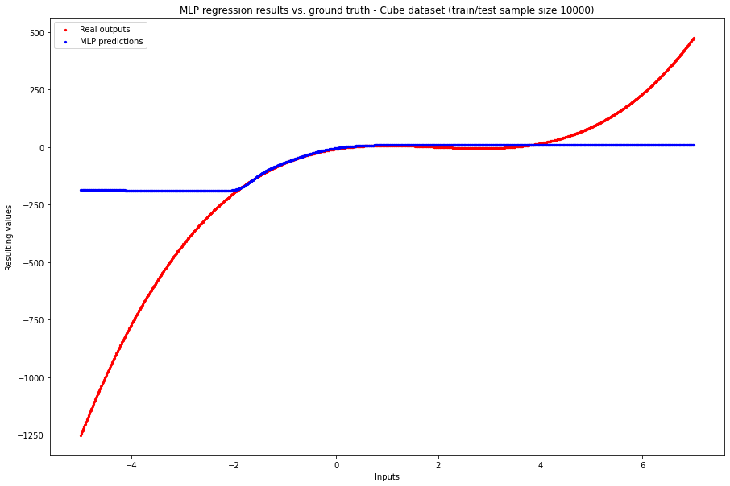
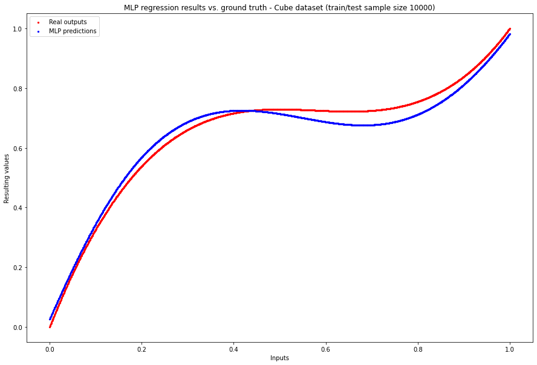
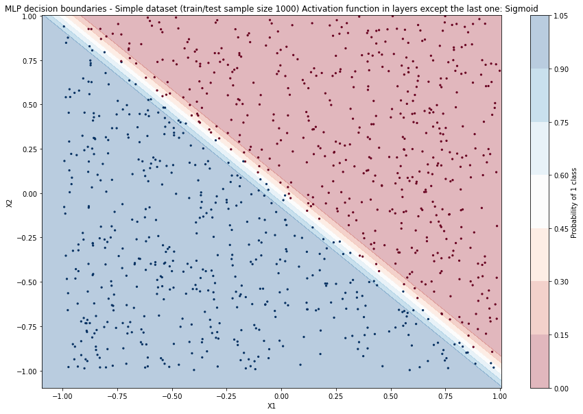
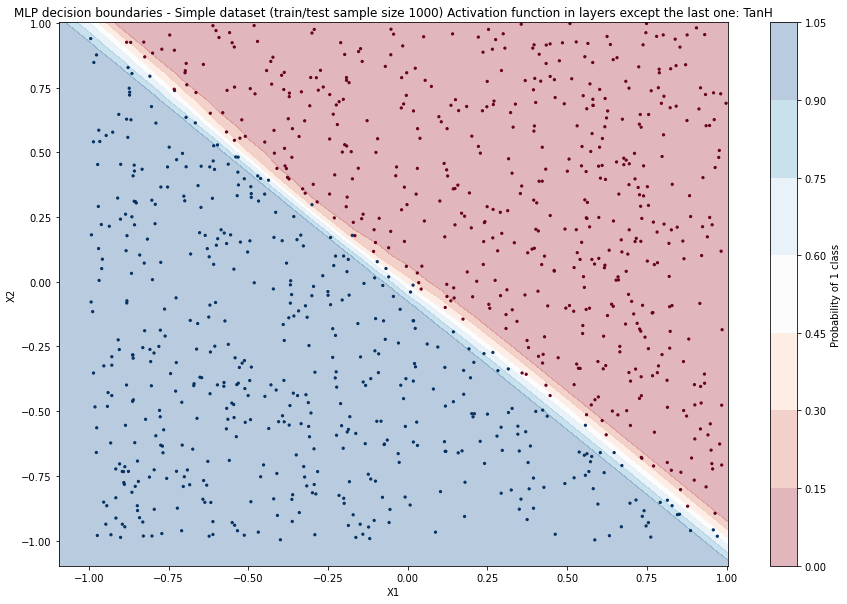
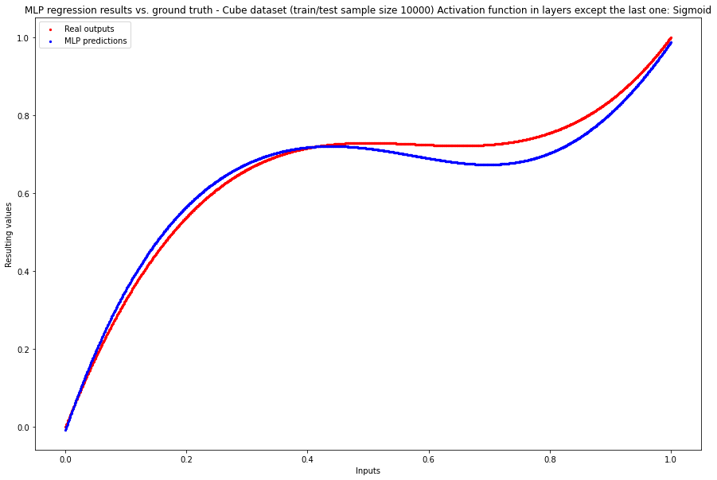
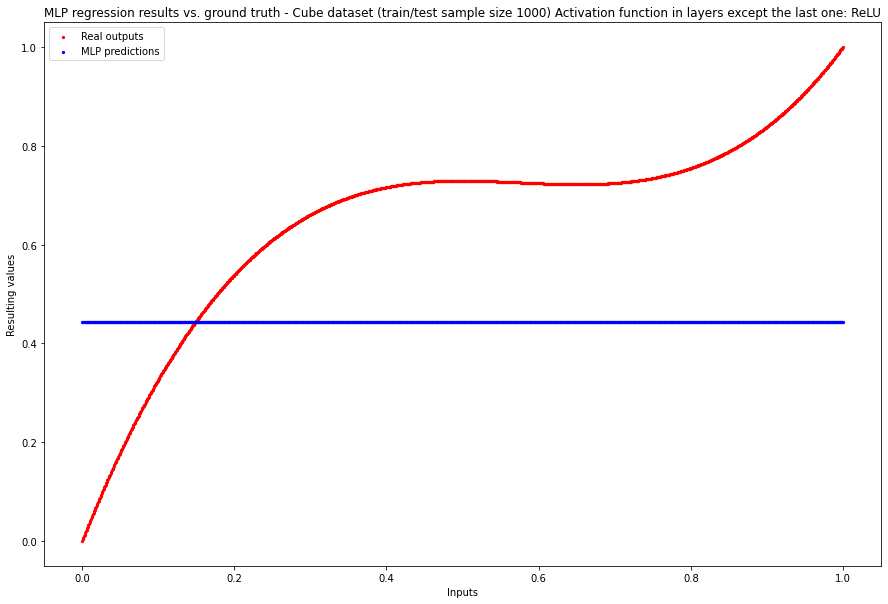
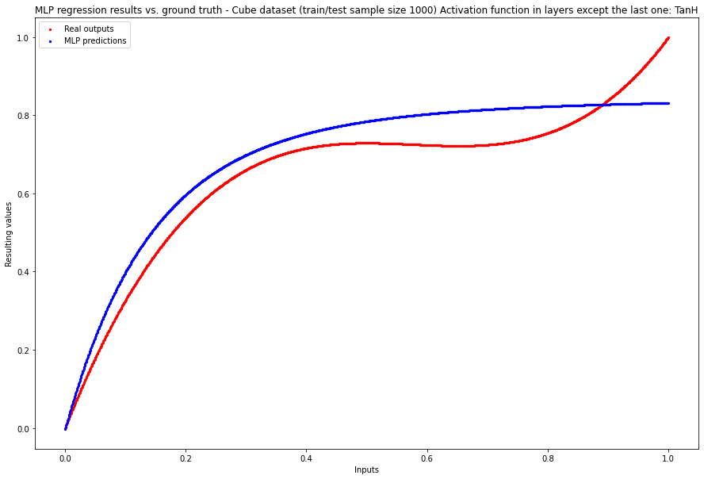

---
# Compile with `pandoc report.md -o report.pdf --highlight-style zenburn`
title: Neural Netoworks Project 3 - Multilayer Perceptron with backpropagation
geometry: margin=4cm
toc: true
author:
  - Antoni Szczepanik
  - Ajewole Adedamola Jude

date: 6th June 2021, Warsaw
include-before: |
	\newpage
---


\newpage

# Problem description

Even though computers can replace a lot of human labor there are still some 
domains which are very hard to automate. Up until recently, the hard to automate
domains included voice and image recognition, classification tasks and a few
others. Today, this problems are solved successfully with machine learning,
in particular with the use of neural networks.

Neural networks, are algorithms inspired by the biological neural networks 
that are present in human brains. Such network is a collection of connected
units called artificial neurons, which loosely mimic neurons in biological 
brain. Each connection, like the synapses in a biological brain, is responsible
for transmitting a signal to other neurons.

Multilayer perceptron is possibly one of the simples neural networks created.
Even though it is very simple in principle, the inner workings of it are
quite complex and interesting. 

In this task we are asked to create a simple MLP from scratch, 
using only libriaries that allow primitive matrix operations. Most importantly
we are asked to implement backpropagation algorithm which will allow the
network to adjust it's parameter to fit the data provided.

\newpage

# How to run the application?
To run the project with exactly the same package versions as we did one can
use any Python virtual env manager.  All requirements are frozen in `requirements.txt` file.
For example using Python built-in venv:

```bash
python3 -m venv venv
source venv/bin/activate
pip install -r requirements.txt
```
After that one can start `jupyterlab` with:

```bash
python -m jupyterlab
```

All experiments are present in `experiment.ipynb` notebook.
The neural network source is present in `toygrad.py`.
Additional plotting helper funcitons are placed in `plot.py`.

\newpage

# Theoretical introduction

Even though MLP is very simple in principle, the inner workings of it are
quite complex and interesting. Especially the training process is nontrivial.

Every MLP is organised into layers of neurons.
Neurons in each layer are connected to all neurons in the previous layer and
all neurons in the following layer.

{ width=250px }

The first layer is called input layer. This layer will take the input we will
provide it with. For example in case of image recognition it would be a vector
representing the image. After that its neurons will fire passing signals to the next
layer. The same will happen for the following layers, until the signal is passed
to the last layer the "output". This is our resulting signal. Depending
on the task they may be one or many output neurons. Interpretation of network
result will also be dependent on the task - the results may be probabilities
or real values, with any number of output signals.

At each neuron it's input signals are multiplied by given connections
weight, the bias is added and later the activation function is applied.

Initially weights and biases are initalized randomly from $(0, 1)$ uniform
distribution. This however makes our network draw random conclusions as well.
We need a way to indroduce updates to weights and biases to allow our network
to "learn".
Hence, we could treat neural network as an optimization problem. The weights
and biases are the thing that could be adjusted, and we optimize for
getting the lowest error possible on the network output.

## Training algorithm

The broad overview of the training algorithm is as follows:

1. Pass a single input through the network. (forward pass)

2. Measure error at the output layer using loss function.

3. Calculate updates for weights and biases based on the error (using 
backpropagation) and update the weights. (backward pass)

4. Repeat the procedure for all training samples.

5. Repeat the procedure based on the whole dataset multiple times called epochs.

### Backpropagation

The algorithm that is used for adjusting the weights of the network is called
backpropagation. It allows to slighly adjust all of the weights (and the
biases, if present) based on error between the output layer and actual values.
It computes the gradient of the loss function with respect to the weights of the
network for a single input–output example. 
In principle the backpropagation algorithm works by computing the gradient of
the loss function with respect to each weight by the chain rule, computing the gradient
one layer at a time, iterating backward from the last layer to avoid redundant calculations
of intermediate terms in the chain rule.

The algorith is parallelizable and efficient, which makes it feasible to use
for training multilayer networks, updating weights to minimize loss.

\newpage

# Experiments

Before running specific experiments we tried to fit our network to each of the
provided datasets. We picked the largest sample size to do that (10000).
This was done to determine reasonable initial paramters before performing 
more specific tests.

The results were satisfactory and the predictions vs. real values plots for all
the datasets are visible below.


{ width=450px }
\break
{ width=450px }
\break
{ width=450px }
\break
{ width=450px }
\break

The results for Cube data as seen above were not satisfactory. After some further inspection
we found out that the distribution of the training and testing data was not the same.
Because of that we normalized both inputs and outputs to (0, 1) range using
min-max normalization. The following - in our opinion satisfactory - result was achieved.
\break


{ width=400px }
\break

## Impact of various activation functions on accuracy

To test impact of activation functions on accuracy we considered 3 activation functions and 2 datasets.
The specified activation function was set in every layer except the last one.

1. Sigmoid
2. ReLU
3. TanH

As a reminder the test were performed on largest datasets available, each of 10000 samples.

###  Simple dataset - binary classification

Apart from the activation functions all other parameters were fixed as follows:

```bash
layers = [
        Layer(in_size=2, out_size=5, activ_function=activation_function),
        Layer(in_size=5, out_size=5, activ_function=activation_function),
        Layer(in_size=5, out_size=1, activ_function=Sigmoid),
    ]
    m = MLP(
        layers=layers,
        loss=BinaryCrossEntropy,
        bias=True,
        batch_size=16,
        epochs=100,
        momentum=0.001,
        learning_rate=0.5,
    )

```

`activation_function` is just one of the three specified activations.

The losses on corresponding test dataset were as follows:

```bash
======================================================================
Simple dataset (train/test sample size 10000)
======================================================================
Sigmoid  - train loss 0.032 (std:0.02) - test loss 0.033 (std:0.11)
ReLU     - train loss 0.025 (std:0.04) - test loss 0.031 (std:0.21)
TanH     - train loss 0.020 (std:0.04) - test loss 0.011 (std:0.08)
======================================================================
```

We can clearly see that the best performance is achieved by TanH activation in
this case. This is also confirmed by low loss standard deviation on the test set.

If we inspect the decision boundary of the network our suspicions are further confirmed.

{ width=450px }
\break
{ width=450px }
\break
{ width=450px }

###  Cube dataset - regression

The next experiment we decided to perform was comparing various activation functions
on regression data. Cube dataset was chosen.
When performing the test on Cube dataset we also fixed all 
other network parameters. They present in the following way.

```bash
layers = [
	Layer(in_size=1, out_size=8, activ_function=activation_function),
	Layer(in_size=8, out_size=8, activ_function=activation_function),
	Layer(in_size=8, out_size=1, activ_function=Linear),
]
m = MLP(
	layers=layers,
	loss=AbsoluteError,
	bias=True,
	batch_size=1,
	epochs=100,
	momentum=0.99,
	learning_rate=0.01,
)

```

`activation_function` is just one of the three specified activations.

\newpage

The losses on corresponding test dataset are as follows:

```bash
=====================================================================
Cube dataset (train/test sample size 10000)
=====================================================================
Sigmoid  - train loss 0.054 (std:0.04) - test loss 0.044 (std:0.04)
ReLU     - train loss 0.163 (std:0.14) - test loss 0.269 (std:0.11)
TanH     - train loss 0.089 (std:0.07) - test loss 0.060 (std:0.03)
=====================================================================
```

We can clearly see that the best performance is achieved by Sigmoid activation in
this case. We may say that the Sigmoid activation function works better in the
case of regression in case of this particular dataset.

This confirms that there are no clear rules about selection of activation functions.

We could also inspect predicions on the test dataset for every activation.

{ width=450px }
\break
We can notice that our prediction curve "bends" slightly but fails to fit the data
perfectly. Possibly this could be fixed by increasing epoch size.
\break
{ width=450px }
\break
With ReLU as activation function our data is not approximated at all. Network
fails to learn and just ouputs constant value as a result.
\break
{ width=450px }
\break
The best result is achieved with TanH activation function. Even though the model
is not fitted perfectly (especially visible for X value from 0.6 - 0.8 range)
it achieves the best result with provided nework architecture and parameters.
\break


## Impact of number of hidden layers and their size on accuracy

To analyze the impact of number and size of hidden layers all remaining parematers
were fixed. Apart from that the grid of possible architectures was tested with
discrete hidden layer number and hidden layer size paramters.

```bash
hidden_layers = [1, 3, 5]
hidden_layer_sizes = [3, 5, 10]
```

### Three Gauss dataset - classification

The following parameters were fixed when performing layer experiments on Gauss dataset:

```bash
layers = [
    Layer(in_size=2, out_size=hidden_layer_size, activ_function=Sigmoid),
    ... hidden layers of appropriate sizes ...
    Layer(in_size=hidden_layer_size, out_size=3, activ_function=SoftMax),
]
m = MLP(
    layers=layers,
    loss=CategoricalCrossEntropy,
    bias=True,
    batch_size=16,
    epochs=100,
    momentum=0.1,
    learning_rate=0.2,
)

```

The losses on test dataset are presented in the table below. Columns correspond to number of hidden layers.
Rows correspond to number of neurons in each hidden layer.


```bash

Layers number:        1 			3 			5
Layer size:
3 	       0.178 (std: 0.40) 	0.367 (std: 0.02) 	0.367 (std: 0.02)
5 	       0.078 (std: 0.18) 	0.367 (std: 0.02) 	0.367 (std: 0.03)
10 	       0.078 (std: 0.20) 	0.367 (std: 0.02) 	0.370 (std: 0.05)
```

We can see that the network learns best in case of having only a single hidden layer.
Especially the single hidden layer size 5 and 10 produce promising results.

With 3 and 5 layers is unable to learn. This could be caused by the fact
that other parameters where initially picked for network of a single hidden layer.
This could be one of the directions of further reaserch.

We conclude that for this specific dataset and other parameters the network 
showed most learning capabilities with only a single hidden layer.

### Activation dataset - regression

The activation dataset was pick-up to test different architectures in case of regression data.
The following parameters were fixed when performing layer experiments on Activation dataset:

```bash
layers = [
    Layer(in_size=1, out_size=hidden_layer_size, activ_function=Sigmoid),
    ... hidden layers of appropriate sizes ...
    Layer(in_size=hidden_layer_size, out_size=1, activ_function=Linear),
]
m = MLP(
    layers=layers,
    loss=AbsoluteError,
    bias=True,
    batch_size=16,
    epochs=70,
    momentum=0.1,
    learning_rate=0.01,
)
```

The losses on test dataset are presented in the table below. Columns correspond to number of hidden layers.
Rows correspond to number of neurons in each hidden layer.

```bash
		1 			3 			5
3 	2.409 (std: 4.69) 	109.665 (std: 60.98) 	109.817 (std: 57.75)
5 	1.871 (std: 3.48) 	109.781 (std: 58.43) 	109.568 (std: 64.96)
10 	1.768 (std: 3.35) 	109.885 (std: 56.73) 	109.712 (std: 59.70)
```

Once again the best result are achieved with small network and hidden layer size. With more layers
the network fails to learn at all.
More interestingly, in case of a single layer the task is better achieved by using more hiddent neurons.
The jump seems to be especially high between 3 and 5 neurons. However adding addictional
5 neurons only decreases the test error slightly.
This is possibly due to the fact that with bigger neuron number model is getting close to overfitting.
If we increased the neuron number even more, the test loss might even increase instead of decreasing.

# Conclusions

We successfuly experimented with both network architecture as well as activation functions.
Unfortunatelly when performing latter experiment the results were not especially
interesting for more than a single hidden layer. Experiments with deep networks with
accordingly adjusted parameters could be interesting further research direction.

Unfortunatelly it is very hard to propose specific conclusions after our experiments.
Neural network hyperparameters seem to be very dependent on specific datasets,
and therefore different parameters may work better in case of different cases.

\newpage

# References and resources used
1. [Andrej Karpathy Micrograd - micro machine learning framework](https://github.com/karpathy/micrograd)
2. [MLPs with Backpropagation. CS 472 – Backpropagation.](https://axon.cs.byu.edu/~martinez/classes/478/slides/BP.pdf)
3. [Brownlee, J. (2016). How to Code a Neural Network with Backpropagation In Python (from scratch).  Machine Learning Mastery.](https://machinelearningmastery.com/implement-backpropagation-algorithm-scratch-python/) 
4. [3Blue1Brown Deep Learning YouTube series](https://www.youtube.com/playlist?list=PLZHQObOWTQDNU6R1_67000Dx_ZCJB-3pi)
