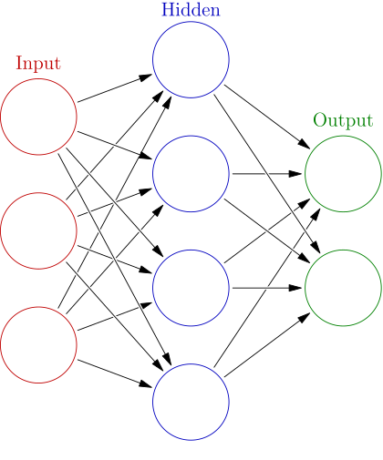
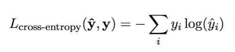

---
# Compile with `pandoc report.md -o report.pdf --highlight-style zenburn`
title: Neural Netoworks Project 3 - Multilayer Perceptron with backpropagation
geometry: margin=4cm
toc: true
author:
  - Antoni Szczepanik
  - Ajewole Adedamola Jude

date: 6th June 2021, Warsaw
include-before: |
	\newpage
---


\newpage

# Problem description

Even though computers can replace a lot of human labor there are still some 
domains which are very hard to automate. Up until recently, the hard to automate
domains included voice and image recognition, classification tasks and a few
others. Today, this problems are solved successfully with machine learning,
in particular with the use of neural networks.

Neural networks, are algorithms inspired by the biological neural networks 
that are present in human brains. Such network is a collection of connected
units called artificial neurons, which loosely mimic neurons in biological 
brain. Each connection, like the synapses in a biological brain, is responsible
for transmitting a signal to other neurons.

Multilayer perceptron is possibly one of the simples neural networks created.
Even though it is very simple in principle, the inner workings of it are
quite complex and interesting. 

In this task we are asked to create a simple MLP from scratch, 
using only libriaries that allow primitive matrix operations. Most importantly
we are asked to implement backpropagation algorithm which will allow the
network to adjust it's parameter to fit the task.

\newpage

# How to run the application?
To run the project with exactly the same package versions as we did one can
use any Python virtual env manager.  All requirements are frozen in `requirements.txt` file.
For example using Python built-in venv:

```bash
python3 -m venv venv
source venv/bin/activate
pip install -r requirements.txt
```
After that one can start `jupyterlab` with:

```bash
python -m jupyterlab
```

All experiments are present in `experiment.ipynb` notebook.
The neural network source is present in `toygrad.py`.
Additional plotting helper funcitons are placed in `plot.py`.

\newpage

# Theoretical introduction

Even though MLP is very simple in principle, the inner workings of it are
quite complex and interesting. Especially the training process is nontrivial.

Every MLP is organised into layers of neurons.
Neurons in each layer are connected to all neurons in the previous layer and
all neurons in the following layer.

{ width=250px }

The first layer is called input layer. This layer will take the input we will
provide it with. For example in case of image recognition it would be a vector
representing the image. After that its neurons will fire passing signals to the next
layer. The same will happen for the following layers, until the signal is passed
to the last layer the "output". This is our resulting signal. Depending
on the task they may be one or many output neurons. Interpretation of network
result will also be dependent on the task - the results may be probabilities,
estimates, etc.


At each neuron it's input signals are multiplied by given connections
weight, the bias is added and later the activation function is applied.

Initially weights and biases are initalized randomly from (0, 1) uniform
distribution. This however makes our network draw random conclusions as well.
We need a way to indroduce updates to weights and biases to allow our network
to "learn".
Hence, we could treat neural network as an optimization problem. The weights
and biases are the thing that could be adjusted, and we optimize for
getting the lowest error possible on the network output.

## Backward Propagation
The Backpropagation algorithm is a supervised learning method
for multilayer feed-forward networks from the field of Artificial Neural Networks.

The information processing of one or more brain cells, 
termed neurons, is the inspiration for feed-forward neural networks.
A neuron receives input signals through its dendrites, which then transmit the signal to the cell body. 
The axon transmits the signal to synapses,
which are the connections between a cell's axon and the dendrites of other cells.

The backpropagation methodology works on the premise of modeling a function by changing the internal weightings of input
signals to create a predicted output signal. The system is taught via supervised learning, in which the difference
between the system's output and a known predicted output is supplied to it and utilized to change its internal state.

Backpropagation can be used for both classification and regression problems, and we wil be focusing on both in 
this project.
When it comes to classification problems, the best results come from networks with one neuron in the output layer for
each class value. Consider a two-class or binary classification issue with A and B as the class values. These 
anticipated results would have to be converted into binary vectors with one column for each class value.
For example, for A and B, [1, 0] and [0, 1] respectively.  This is called a one hot encoding.
In Regression problems,we Replace output node with a linear activation (i.e. identity
which just passes the net value through) which more naturally supports unconstrained regression l Since f '(net) 
is 1 for the linear activation, the output error is just (target – output)
l Hidden nodes still use a standard non-linear activation
function (such as sigmoid) with the standard f '(net) 

## Loss Functions
### BinaryCrossEntropy
This loss can also be called the Log Loss. Binary crossentropy is a loss function that is used in binary classification tasks. These are tasks that answer a question with only two choices (yes or no, A or B, 0 or 1, left or right). Several independent such questions can be answered at the same time, as in multi-label classification or in binary image segmentation.
Formally, this loss is equal to the average of the categorical crossentropy loss on many two-category tasks.

where 
y_i is the ii-th scalar value in the model output.
-(y_i) is the corresponding target value, and output size is the number of scalar values in the model output.
This is equivalent to the average result of the categorical crossentropy loss function applied to many independent
classification problems, each problem having only two possible classes with target probabilities y_i and (1-(y_1)).
  
### CategoricalCrossEntropy
Categorical crossentropy is a loss function that is used in multi-class classification tasks. These are tasks where an example can only belong to one out of many possible categories, and the model must decide which one.
Formally, it is designed to quantify the difference between two probability distributions.

The categorical crossentropy loss function calculates the loss of an example by computing the following sum:

where y_1 is the ii-th scalar value in the model output, 
(y_1) is the corresponding target value, and output size is the number of scalar values in the model output.

# Experiments

## Impact of various activation functions on accuracy

TODO: how does activation function affect the model’s accuracy?
TODO: Experiment with sigmoid and twoother activation functions.  
TODO: The activation function in an output layer should be chosen accordingly to the problem

### Clasification Results
### Regression Results

## Impact of number of hidden layers and their size on accuracy

TODO: how does the number of hidden layers and number of neurons in hidden 
layers impact themodel’s accuracy?  

TODO: Analyze different architectures

### Clasification Results
### Regression Results

## Impact of various loss functions  on accuracy

### Clasification Results
### Regression Results

# Conclusions
TODO: Including reasons for success/failure, further research proposals...

# References
1. Brownlee, J. (2016). How to Code a Neural Network with Backpropagation In Python (from scratch). 
   Machine Learning Mastery.
   Retrieved from https://machinelearningmastery.com/implement-backpropagation-algorithm-scratch-python/
   
2. MLPs with Backpropagation. CS 472 – Backpropagation. 
   Retrieved from https://axon.cs.byu.edu/~martinez/classes/478/slides/BP.pdf