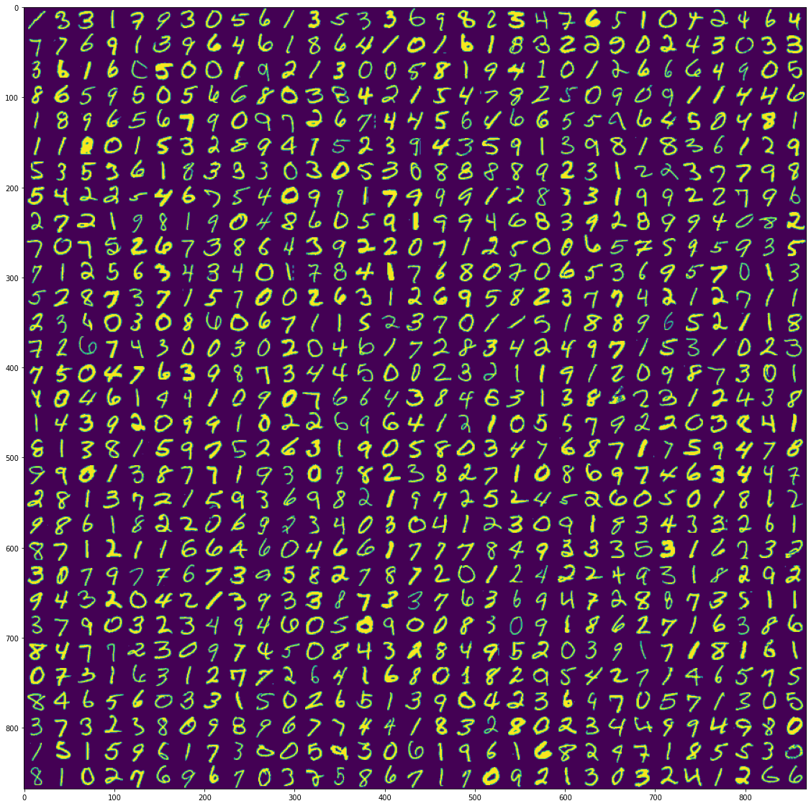
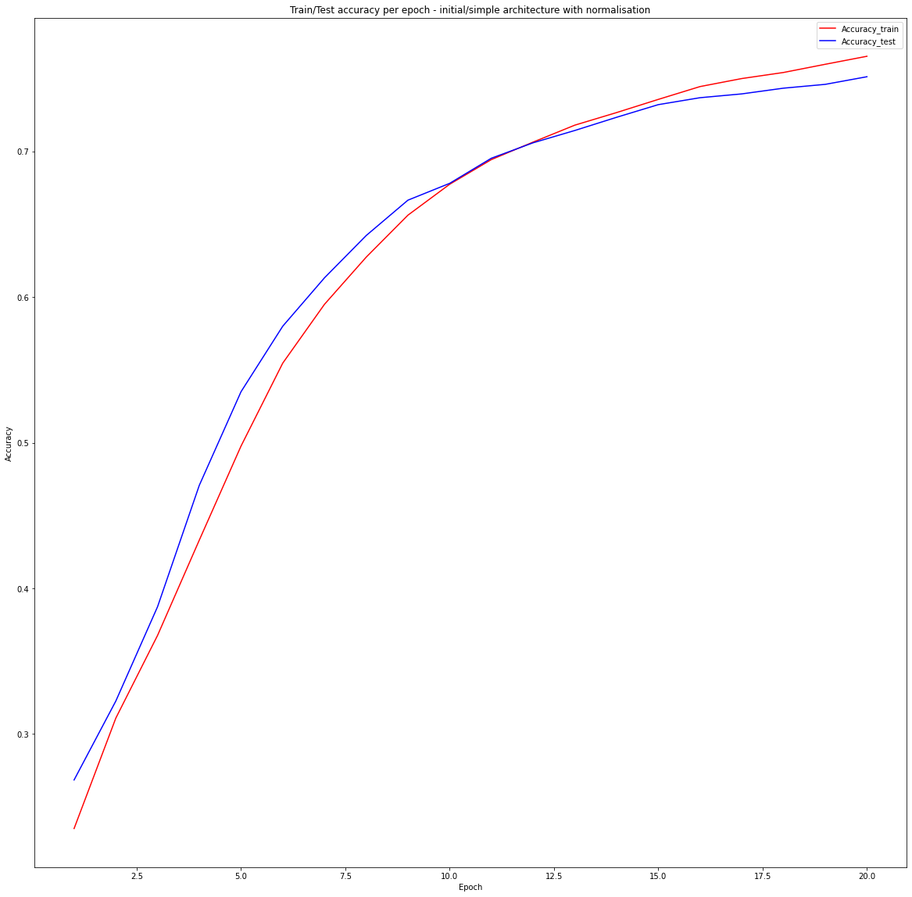
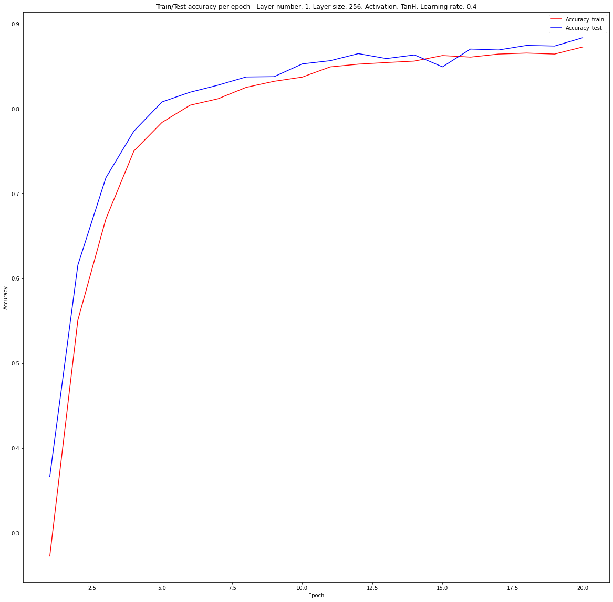

---
# Compile with `pandoc report.md -o report.pdf --highlight-style zenburn`
title: Appendix -  Neural Networks Project 3 - training MLP on MNIST dataset
geometry: margin=4cm
toc: true
author:
  - Antoni Szczepanik
  - Ajewole Adedamola Jude

date: 11th June 2021, Warsaw
include-before: |
	\newpage
---

\newpage

# Problem description

The task for the second part of the assignment is to train previously created
MLP on MNIST dataset. This is a dataset of annotated handwritten digits.
By inspecting a few of the entries we can get intuitive feel of the dataset.

{ width=400px }

# How to run the application?

To run the project with exactly the same package versions as we did one can
use any Python virtual env manager.  All requirements are frozen in `requirements.txt` file.
For example using Python built-in venv:

```bash
python3 -m venv venv
source venv/bin/activate
pip install -r requirements.txt
```
After that one can start `jupyterlab` with:

```bash
python -m jupyterlab
```
Please note that MNIST model training and analysis is done based in `mnist.ipynb` notebook.

# Network Development

# Measuring accurracy

As defined on Kaggle platform the metric against which our solution will be
evaluated is accuracy. Accuracy is a very intuitive metrics which is defined
as ratio of number of correct predictions and number of all samples.

\begin{equation}
	accuracy = \frac{\text{Number of correct prections}}{\text{Total number of predictions}}
\end{equation}


# Train/Test split

We decide to perform a simple split of our data into a training set (80%),
and testing/validation set (20%).
Training data was shuffled before using it.

All Y values have been one hot encoded to allow comparing between network outputs.

# Initial architecture

At first we decide to perform a single training with very simple, almost default
parameters. This will allow us to benchmark other parameter combinations 
against it.

The parameters of the first run were as follows:

```python
layers = [
    Layer(in_size=28*28, out_size=32, activ_function=Sigmoid),
    Layer(in_size=32, out_size=10, activ_function=SoftMax),
]
m = MLP(
    layers=layers,
    loss=CategoricalCrossEntropy,
    metrics=[Accuracy],
    bias=True,
    batch_size=8,
    epochs=20,
    momentum=0.,
    learning_rate=0.3,
    verbosity=2,
)

```

Unfortunately, network with such parameters completely failed to produce any useful output.

{ width=400px }

The accuracy on testing dataset was close to **10%**, which means our network was
producing random results. In the following steps we will try to improve upon this score.

# Adding normalisation and standarisation

We decided perform normalisation and standarisation on model inputs. This will
hopefully cause network to converge faster and speed up the learning process.

As a normalisation we first scaled our values to (0, 1) range (min-max scaling).
This was followed by a standarisation procedure of following form:

\begin{equation}
	X' = \frac{X-mean(X)}{std(X)}
\end{equation}

Mean and standard deviations were precomputed based on the training dataset.
Their fixed values were used to apply the same transformation on the testing
dataset as well.

Indeed the procedures allowed the network to train, producing our first
reasonable result - test error of **76%**.

{ width=400px }


We can notice that both testing and testing accuracies go line in line and no
over-fitting takes place. Additionally the trend is upward - we can conclude that
increasing epoch number should yield even better results.

# Automatic Hyperparameter tuning

We have successfully achieved decent accuracy, but we would like to further improve
our results. To do that we tried to search for the parameters that might
yield better results on the testing set.
We performed Grid Search over many possible architectures and parameters.

The top 30 results with regards to test set accuracy are presented below.
Full results are present in `doc/` folder in form of a csv file. All results could
be reproduced using `mnist.ipynb` notebook.


|rank   |activ  |l_size|l_num|lr    |epochs |test_acc     |train_loss|train_loss_std|momentum|
|-------|-------|------|-----|------|-------|-------------|----------|--------------|--------|
|0      |TanH   |256   |1    |0.400 |20     |0.883        |0.272     |1.579         |0.100   |
|1      |TanH   |128   |1    |0.400 |20     |0.880        |0.176     |1.016         |0.000   |
|2      |TanH   |32    |1    |0.300 |20     |0.878        |0.055     |0.309         |0.000   |
|3      |TanH   |128   |1    |0.300 |20     |0.878        |0.129     |0.742         |0.000   |
|4      |Sigmoid|128   |1    |0.400 |20     |0.877        |0.082     |0.472         |0.500   |
|5      |TanH   |128   |1    |0.400 |20     |0.877        |0.173     |0.994         |0.010   |
|6      |TanH   |32    |1    |0.400 |20     |0.877        |0.062     |0.349         |0.000   |
|7      |TanH   |64    |1    |0.400 |20     |0.876        |0.115     |0.663         |0.000   |
|8      |TanH   |128   |1    |0.300 |20     |0.876        |0.148     |0.859         |0.100   |
|9      |TanH   |256   |1    |0.400 |20     |0.876        |0.260     |1.496         |0.010   |
|10     |TanH   |128   |1    |0.300 |20     |0.876        |0.138     |0.799         |0.010   |
|11     |TanH   |128   |1    |0.400 |20     |0.876        |0.183     |1.065         |0.100   |
|12     |TanH   |256   |1    |0.300 |20     |0.876        |0.221     |1.284         |0.100   |
|13     |TanH   |256   |1    |0.300 |20     |0.873        |0.195     |1.131         |0.010   |
|14     |TanH   |64    |1    |0.300 |20     |0.873        |0.085     |0.490         |0.000   |
|15     |TanH   |128   |1    |0.100 |20     |0.872        |0.089     |0.516         |0.500   |
|16     |TanH   |256   |1    |0.100 |20     |0.868        |0.135     |0.777         |0.500   |
|17     |Sigmoid|256   |1    |0.400 |20     |0.867        |0.114     |0.664         |0.500   |
|18     |TanH   |32    |2    |0.300 |20     |0.865        |0.057     |0.304         |0.000   |
|19     |TanH   |128   |1    |0.300 |20     |0.864        |0.258     |1.482         |0.500   |
|20     |TanH   |256   |1    |0.100 |20     |0.859        |0.072     |0.406         |0.100   |
|21     |Sigmoid|128   |1    |0.300 |20     |0.857        |0.074     |0.421         |0.500   |
|22     |Sigmoid|256   |1    |0.500 |20     |0.857        |0.095     |0.544         |0.000   |
|23     |TanH   |256   |1    |0.100 |20     |0.850        |0.069     |0.388         |0.010   |
|24     |Sigmoid|32    |1    |0.500 |20     |0.848        |0.060     |0.328         |0.000   |
|25     |Sigmoid|128   |1    |0.500 |20     |0.847        |0.068     |0.384         |0.000   |
|26     |Sigmoid|256   |1    |0.400 |20     |0.847        |0.081     |0.458         |0.000   |
|27     |Sigmoid|64    |1    |0.500 |20     |0.845        |0.064     |0.352         |0.000   |
|28     |TanH   |128   |1    |0.100 |20     |0.843        |0.059     |0.326         |0.100   |
|29     |Sigmoid|128   |1    |0.400 |20     |0.842        |0.067     |0.370         |0.000   |
|30     |TanH   |128   |1    |0.400 |20     |0.841        |0.364     |2.063         |0.500   |
|

As we can see the best score which we achieved over 20 epochs was **88%** accuracy.
Most of the top scoring networks had only a single layer and used hyperbolic tangent
as an activation function. Additionally learning rates around ~0.3/0.4 seemed
to also characterize the best parameter sets. 

Let's take a look at accuracy of our best model over time.



By inspecting the graph it looks like we are not over-fitting yet. It is promising
and means we may be able to increase testing accuracy further.
In the next steps we will try to improve the most interesting architecture.

# Further adjusting layer size

As we noticed in the automatic optimization step, all of the networks in top 30 are a 
single layer networks. We will stick to that assumption in further improvements.
We will also stick to TanH activation function, as it also was common across the
best results.

Also, as the top network has the highest neuron number we will try to increase
it even more. We will check what is the performance of the top network, but
with 256, 512 and 1024 neurons in the hidden layer.

The architecture we settled on has the following parameters:

```python
size = [256, 512, 1024]
layers = [
    Layer(in_size=28*28, out_size=size, activ_function=TanH),
    Layer(in_size=size, out_size=10, activ_function=SoftMax),
]
m = MLP(
    layers=layers,
    loss=CategoricalCrossEntropy,
    metrics=[Accuracy],
    bias=True,
    batch_size=8,
    epochs=100,
    momentum=0.1,
    learning_rate=0.4,
    verbosity=2,
)

```

The results of training on this three architecture is summarized in the table
below.

|    | activ|layer_size |   hidden_l_nu |   lr |   epochs |test_accuracy |train_loss |train_loss_std |
|---:|:-----|----------:|--------------:|-----:|---------:|-------------:|----------:|--------------:|
|  0 | TanH |       256 |             1 |  0.4 |       20 |     0.879524 |   1.50322 |       2.24568 |
|  1 | TanH |       512 |             1 |  0.4 |       20 |     0.735952 |   4.12758 |       4.9709  |
|  2 | TanH |      1024 |             1 |  0.4 |       20 |     0.601667 |   6.04071 |       6.09031 |
|

We can clearly see that increasing the layer size decreases our result. It is possible
that if we incresed the epoch number we would be able to achieve better result with
higher number of neurons. However such solution may be impractical because of the
higher time consumption which large layers sizes cause.

For further development we decided to settle on 256 neurons in the single hidden layer.

# Final training

To train or final solution to the problem we let the network of specified
architecture train for a little longer than before. We performed a
total of 120 epochs. After a hundred epochs with the best parameters found 
so far we decided to decrease learning rate.
We hoped that a little more granularity may help even further decrease the
accuracy. We are aware there are solutions to build learning rate optimization
into the network, but this was not introduced in our case.

1. Training the network with the same set of parameters but over larger amount of epochs.

2. Trying to further optimize after decreasing learning rate to 0.001.


The final result we have achieved is **92%** accuracy on our testing set.
Such trained network was used to make final Kaggle predictions.

# Further improvements

There are several major steps that would surely allow to train even better model.

First of all we could perform more preprocessing operations before we start training.

- The process called deskewing could be applied to make sure all the images
are "horizontal".

- We could filter out pixels whose values do not change across the images.
This would decrease the number of neurons and should speed up computations.

- We could augment our training dataset by extending it with images that were 
slightly modified, for example rotating them a little or moving by small random
offsets. This would allow to increase testing set size "for free".

Apart from that several modifications could be developed to make learning 
more successful.

- Dropout layers could be introduced. They  are simple yet effective method of
handling over-fitting.

# References

[Results of various algorithms on MNIST dataset](http://yann.lecun.com/exdb/mnist/)
